# Serverless Image Processing Pipeline

## Architecture
S3 → Lambda → DynamoDB + SNS

## Services Used
- AWS S3
- AWS Lambda (Python 3.12)
- AWS DynamoDB
- AWS SNS
- AWS IAM

## How It Works
1. Image uploaded to S3 triggers Lambda automatically
2. Lambda extracts metadata (filename, size, timestamp)
3. Metadata stored in DynamoDB with UUID partition key
4. SNS sends email alert within 5 seconds

## Screenshots

### S3 Bucket

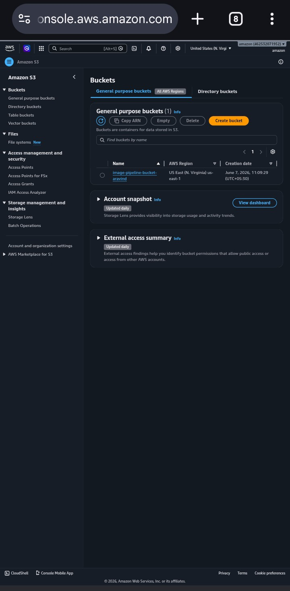

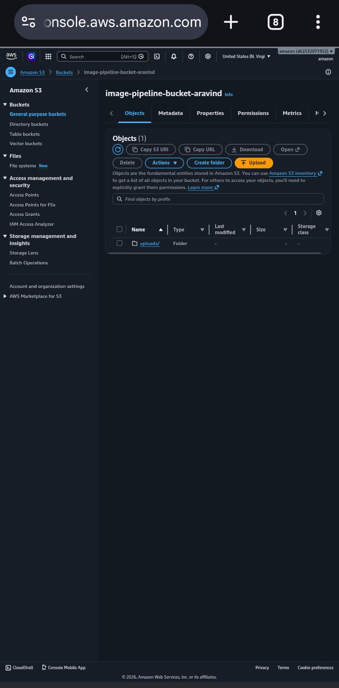

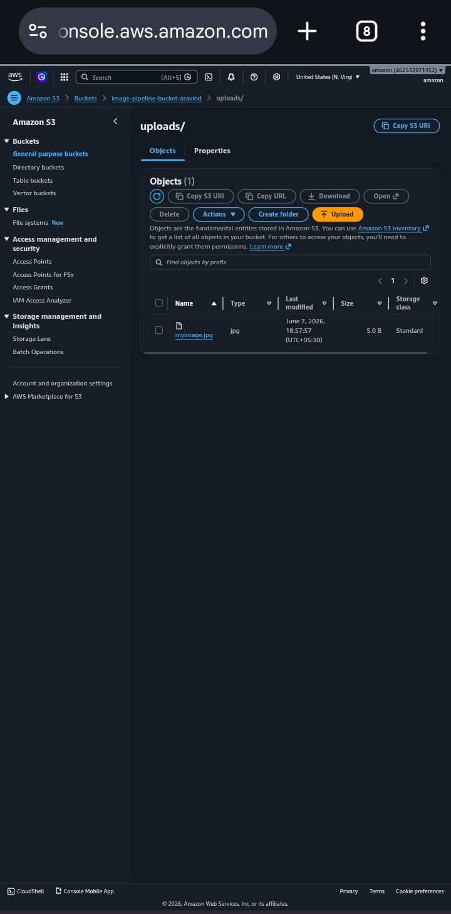

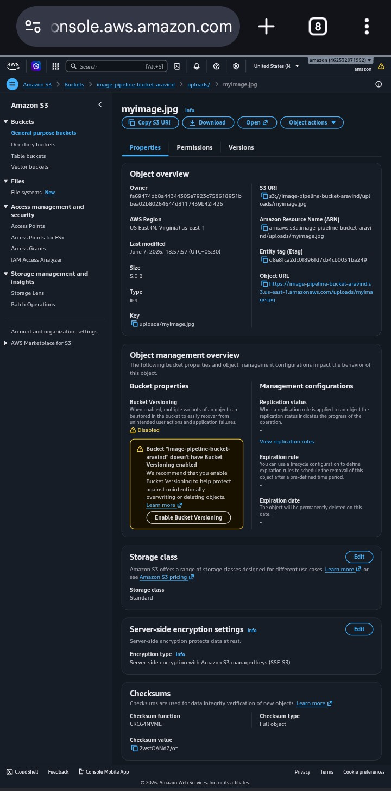

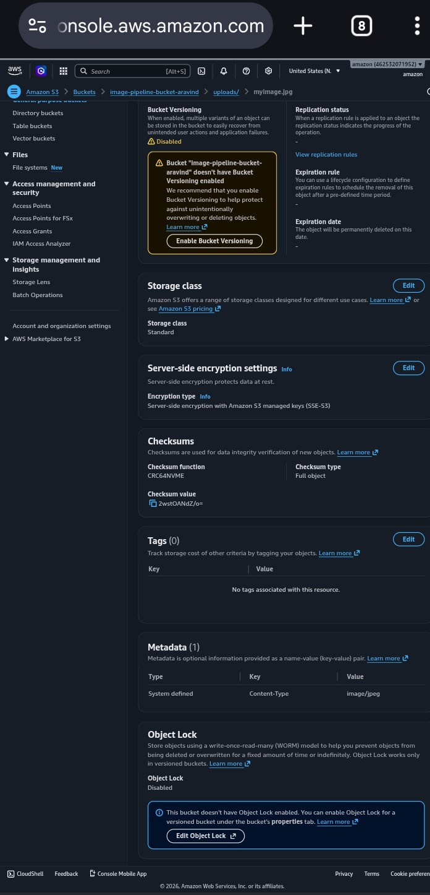

### DynamoDB Entry

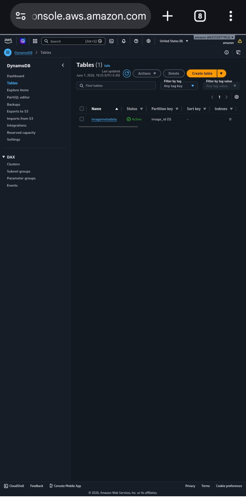

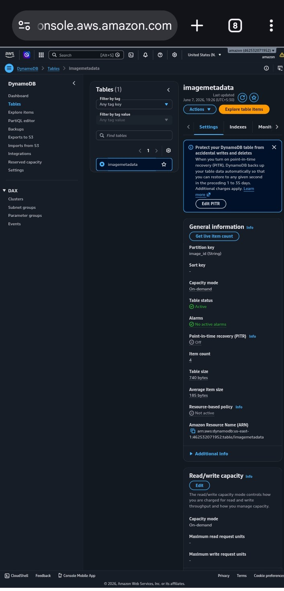

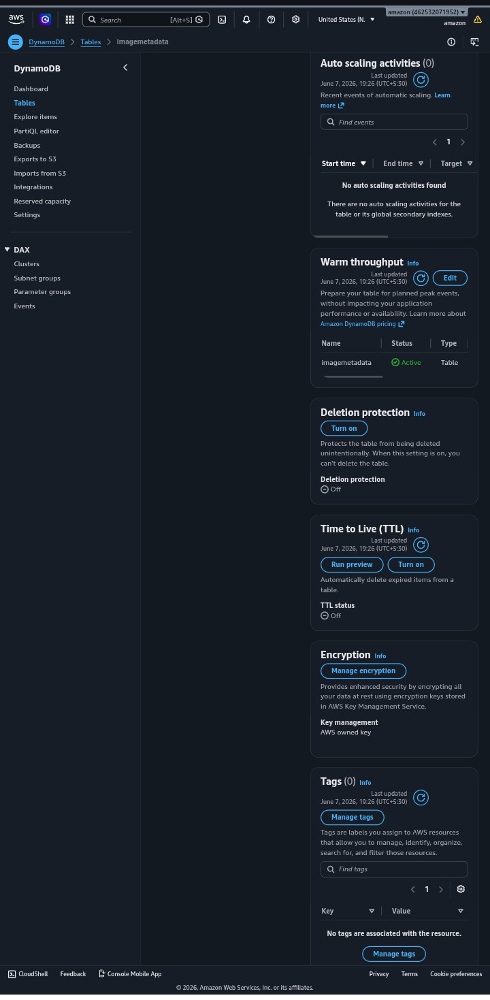

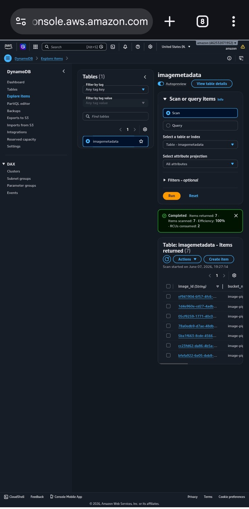

### CloudWatch Logs

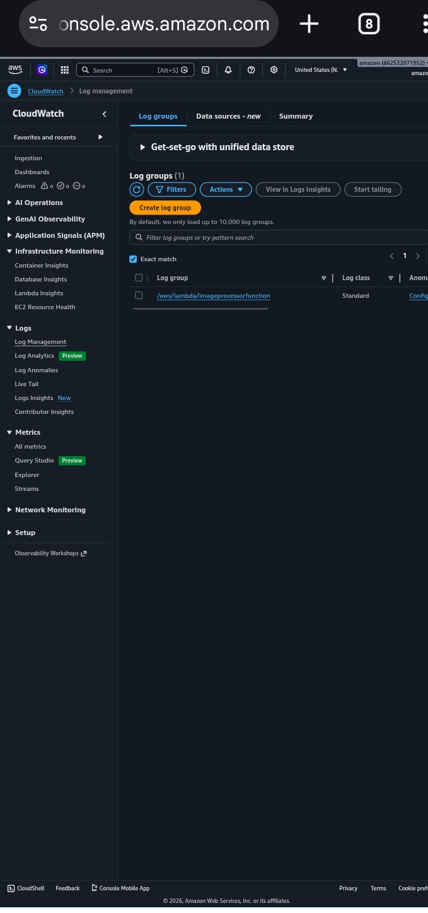

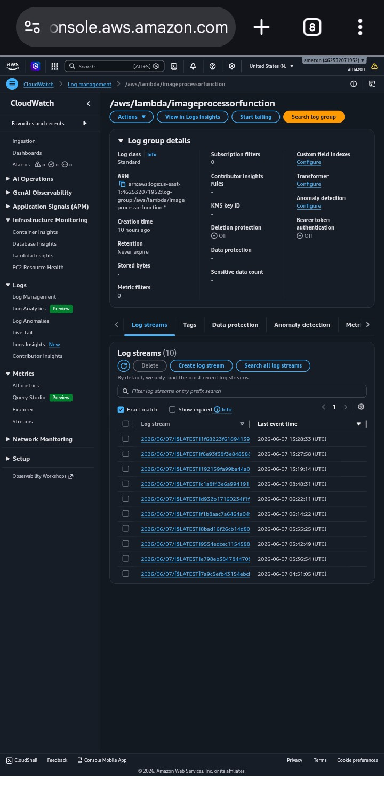

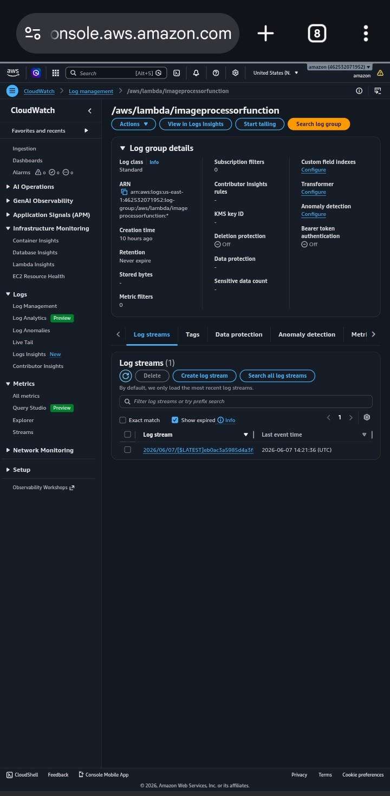

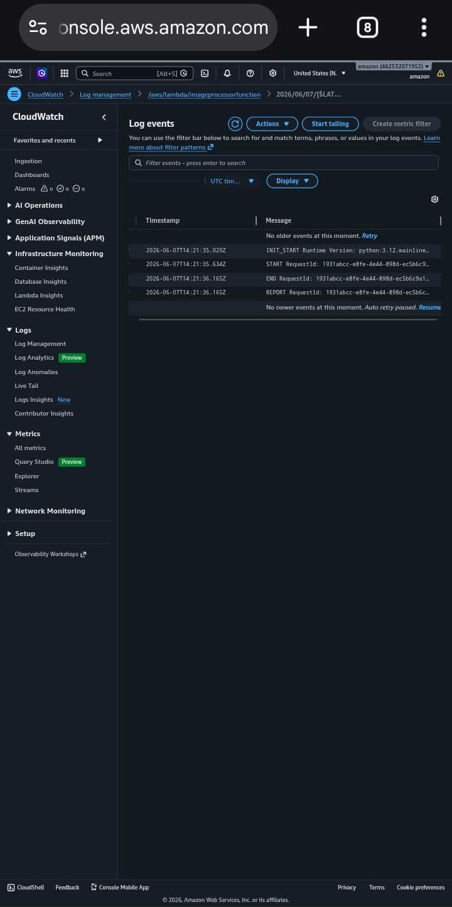

### SNS Email Alert

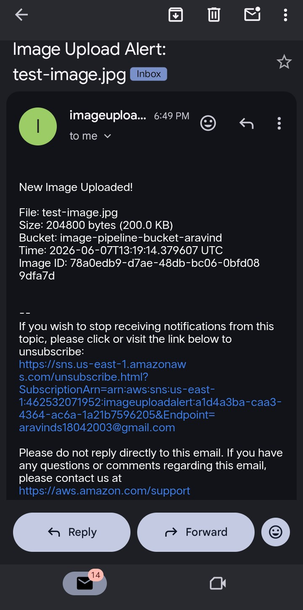

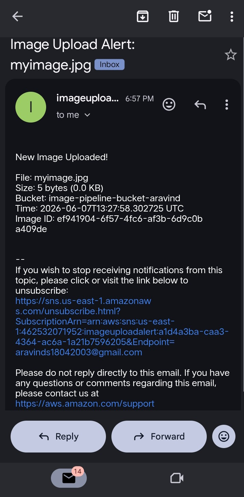
